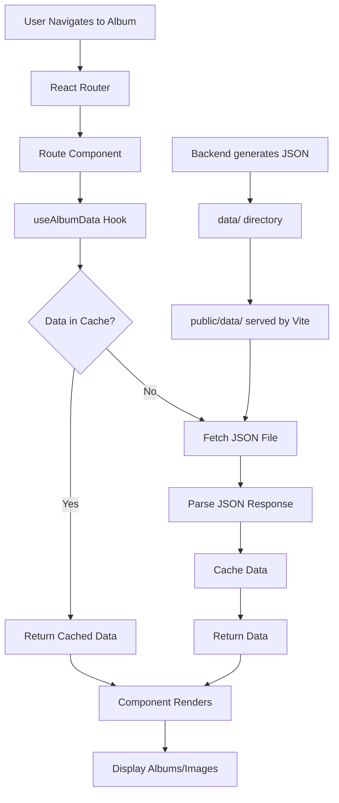
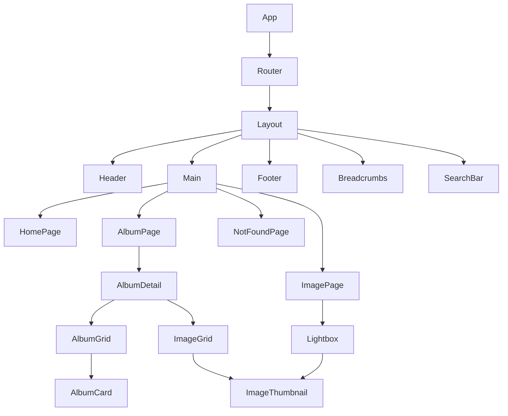
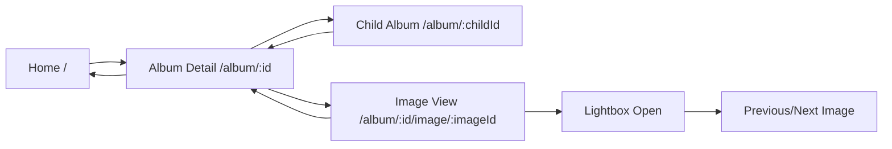
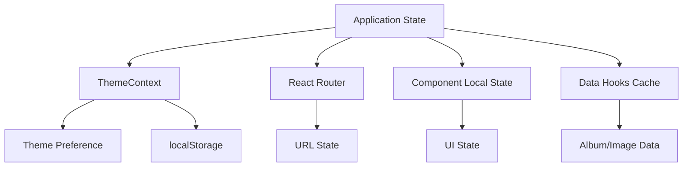

# Frontend Architecture Documentation

## Overview

This document describes the frontend architecture for the gallery2-to-static React SPA. The frontend consumes static JSON files generated by the backend (see [backend architecture](../__docs/architecture.md)) and provides a modern, accessible gallery viewing experience.

The frontend is a single-page application (SPA) built with React 18+, Vite, TypeScript, and React Router. It displays albums and images from the Gallery 2 archive in a responsive, accessible interface with features including album navigation, image viewing, theming, and search/filter functionality.

For related information, see:
- [Backend Architecture](../__docs/architecture.md) - Backend codebase structure and JSON generation
- [Data Flow](../__docs/data-flow.md) - Backend recursive algorithm and data processing
- [Types](../__docs/types.md) - Shared type definitions
- [Overview](../__docs/overview.md) - System overview and purpose

## Table of Contents

- [Architecture Principles](#architecture-principles)
- [Project Structure](#project-structure)
- [Tech Stack](#tech-stack)
- [JSON Data Structure](#json-data-structure)
- [Data Flow Architecture](#data-flow-architecture)
- [Component Architecture](#component-architecture)
- [Routing Architecture](#routing-architecture)
- [State Management Architecture](#state-management-architecture)
- [Integration Points](#integration-points)
- [Future Enhancement Support](#future-enhancement-support)

## Architecture Principles

### Design Philosophy

The frontend architecture is designed around the following principles:

1. **Static First**: The application consumes pre-generated static JSON files with no API server required. Data is loaded at runtime via HTTP fetch operations.
2. **Performance**: Optimize for fast initial load times, efficient data loading, and smooth user interactions. Large datasets are handled through virtualization and lazy loading.
3. **Accessibility**: Full WCAG 2.1 AA compliance with keyboard navigation, screen reader support, and proper ARIA attributes throughout.
4. **Maintainability**: Clear separation of concerns, reusable components, consistent patterns, and comprehensive type safety.
5. **Extensibility**: Architecture supports future enhancements like import functionality, advanced search, and additional viewing modes.

### Quality Attributes

- **Performance**: Target Lighthouse score > 90, initial bundle size < 200KB gzipped, smooth 60fps interactions
- **Accessibility**: WCAG 2.1 AA compliance, keyboard navigation, screen reader support
- **Maintainability**: Clear component boundaries, consistent patterns, comprehensive documentation
- **Scalability**: Support for large galleries (1000+ items), virtual scrolling, efficient data loading
- **Browser Support**: Modern browsers (Chrome, Firefox, Safari, Edge), graceful degradation where needed

## Project Structure

### Decision: Separate Frontend Directory

**Rationale:** The frontend is organized in a separate `frontend/` directory to maintain clear separation between backend (Node.js/TypeScript for JSON generation) and frontend (React/Vite SPA) concerns. This approach provides:

- **Clear boundaries**: Frontend and backend have distinct purposes and can evolve independently
- **Independent builds**: Frontend build process doesn't interfere with backend execution
- **Shared types**: Type definitions can be shared from `backend/types.ts` without complex monorepo tooling
- **Simple deployment**: Frontend builds to static assets that can be deployed separately
- **Maintainability**: Easier to understand and navigate the codebase

**Rejected Alternatives:**
- **Monorepo with workspaces**: Considered but rejected due to added complexity. The project doesn't require multiple frontend apps or complex shared package management. The simple approach of a separate directory with shared types is sufficient.
- **Completely separate repository**: Rejected because shared type definitions benefit from being in the same repository, and the frontend directly consumes backend-generated JSON files.

### Directory Structure

The frontend directory structure follows feature-based organization with clear separation of concerns:

```
frontend/
├── public/                 # Static assets (images, icons, etc.)
│   └── data/              # JSON files from backend (symlink or copy)
├── src/
│   ├── components/        # Reusable UI components
│   │   ├── Layout/       # Layout components (Header, Footer, Main)
│   │   ├── AlbumGrid/    # Album grid display component
│   │   ├── ImageGrid/    # Image grid display component
│   │   ├── ImageThumbnail/ # Reusable image thumbnail component
│   │   ├── AlbumDetail/  # Album detail view component
│   │   ├── Breadcrumbs/  # Breadcrumb navigation component
│   │   ├── Lightbox/     # Image lightbox/modal component
│   │   └── Search/       # Search components
│   ├── pages/            # Page-level components (route handlers)
│   │   ├── HomePage.tsx
│   │   ├── AlbumPage.tsx
│   │   ├── ImagePage.tsx
│   │   └── NotFoundPage.tsx
│   ├── hooks/            # Custom React hooks
│   │   ├── useAlbumData.ts
│   │   ├── useImageData.ts
│   │   └── useSearch.ts
│   ├── utils/            # Utility functions
│   │   ├── dataLoader.ts # JSON loading utilities
│   │   ├── pathBuilder.ts # Breadcrumb path construction
│   │   └── cache.ts      # Data caching utilities
│   ├── contexts/         # React Context providers
│   │   └── ThemeContext.tsx
│   ├── types/            # Frontend-specific type definitions
│   │   └── index.ts
│   ├── styles/           # Global styles and themes
│   │   ├── themes.css    # CSS variables for theming
│   │   └── global.css    # Global styles
│   ├── App.tsx           # Root component with router
│   └── main.tsx          # Application entry point
├── docs/                 # Frontend-specific documentation
│   └── architecture.md   # This file
├── vite.config.ts        # Vite configuration
├── tsconfig.json         # TypeScript configuration
├── package.json          # Frontend dependencies
└── README.md             # Frontend setup and usage
```

### File Naming Conventions

- **Components**: PascalCase (e.g., `AlbumGrid.tsx`, `ImageThumbnail.tsx`)
- **Hooks**: camelCase with "use" prefix (e.g., `useAlbumData.ts`, `useSearch.ts`)
- **Utilities**: camelCase (e.g., `dataLoader.ts`, `pathBuilder.ts`)
- **Types**: camelCase (e.g., `index.ts` in types directory)
- **Styles**: kebab-case (e.g., `themes.css`, `global.css`)
- **Configuration files**: kebab-case or standard names (e.g., `vite.config.ts`, `tsconfig.json`)

### Component Organization Pattern

Components are organized by feature/domain rather than by technical role:
- Feature-based grouping keeps related components together (e.g., all AlbumGrid sub-components in `AlbumGrid/`)
- Each feature directory can contain its own styles, tests, and sub-components
- Shared/reusable components are at the top level of `components/`

## Tech Stack

### Core Technologies

- **React 18+**: Modern React with hooks, concurrent features, and improved performance
- **Vite 5+**: Fast build tool with excellent development experience and optimized production builds
- **TypeScript 5+**: Type safety and improved developer experience
- **React Router v6**: Client-side routing with BrowserRouter for modern static hosting
- **CSS Custom Properties**: Theme system using CSS variables for dynamic theming

### Additional Dependencies

- **Vitest**: Unit testing framework (works seamlessly with Vite)
- **React Testing Library**: Component testing utilities
- **Accessibility libraries**: Focus management, ARIA utilities (as needed)

### Rationale for Technology Choices

**React 18+**: Industry standard, excellent ecosystem, strong TypeScript support, modern concurrent features improve performance.

**Vite**: Significantly faster than Create React App, excellent TypeScript support, modern ES modules, optimized production builds with code splitting.

**TypeScript**: Type safety catches errors early, improves IDE experience, better refactoring support, documentation through types.

**React Router v6**: Standard routing solution, excellent TypeScript support, supports both BrowserRouter (for modern hosts) and HashRouter (for GitHub Pages compatibility if needed).

**CSS Custom Properties**: Simple, performant theming without JavaScript overhead, supports system preference detection via media queries.

### Build and Development Setup

**Vite Configuration:**
- Development server on port 3000 (or configured port)
- Hot Module Replacement (HMR) for fast development
- Build output to `dist/` directory
- Static asset handling for JSON files in `public/data/`

**TypeScript Configuration:**
- Frontend and backend have independent TypeScript configurations
- React-specific compiler options (JSX: react-jsx)
- Path aliases for clean imports (`@/components`, `@/utils`, etc.)
- Strict type checking enabled

**Development Workflow:**
1. Backend generates JSON files to `../data/` directory (project root, relative to backend directory)
2. Frontend serves JSON from `public/data/` (via symlink, copy, or build script)
3. Development server watches for changes with HMR
4. Production build optimizes and bundles for static hosting

## JSON Data Structure

### File Organization

**File Naming Convention:**
- JSON files are named using the album ID (e.g., `7.json`, `12.json`)
- Each file corresponds to a single album and contains all children of that album
- Files are stored in the `data/` directory at project root (backend output) or `public/data/` directory (frontend serving)

**File Structure:**
- Each JSON file contains an array of `Child` objects
- The array represents all direct children (both albums and photos) of the parent album
- Files are organized hierarchically: parent album ID determines filename

### Data Schema

**Child Interface Structure:**

The `Child` interface (from [backend/types.ts](../../backend/types.ts)) defines the structure of each item in the JSON array:

```typescript
interface Child {
    id: number;              // Unique identifier for the item
    type: string;            // Entity type: 'GalleryAlbumItem' or 'GalleryPhotoItem'
    hasChildren: boolean;    // True for albums, false for photos
    title: string;           // Display title
    description: string;     // Description text
    pathComponent: string;   // Path component for URL construction
    timestamp: number;       // Origination timestamp (Unix epoch)
    width: number | null;    // Image width (null for albums)
    height: number | null;   // Image height (null for albums)
    thumb_width: number | null;   // Thumbnail width (null if no thumbnail)
    thumb_height: number | null;  // Thumbnail height (null if no thumbnail)
    ownerName?: string | null;    // Owner display name (User); null when user missing
    summary?: string | null;      // Item summary (distinct from description); optional
}
```

**Field Documentation:**
- `id`: Unique numeric identifier, used for file naming and routing
- `type`: Distinguishes between albums (`'GalleryAlbumItem'`) and photos (`'GalleryPhotoItem'`)
- `hasChildren`: Boolean flag indicating if item can contain children (albums have children, photos do not)
- `title`: User-facing title, may be empty string
- `description`: User-facing description, may be empty string
- `pathComponent`: Single path segment for albums, full constructed path for photos (see Path Construction below)
- `timestamp`: Unix timestamp in seconds (or milliseconds, depending on Gallery 2 configuration)
- `width`/`height`: Image dimensions, null for albums or items without dimensions
- `thumb_width`/`thumb_height`: Thumbnail dimensions, null if thumbnail not generated or unavailable
- `ownerName`: Owner display name from Gallery 2 User (fullName or userName); optional, null when user missing
- `summary`: Item summary from Gallery 2; optional, distinct from description

### Data Relationships

**Parent-Child Hierarchy:**
- Albums can contain both child albums and photos
- Photos are leaf nodes (no children)
- Hierarchy is represented by album IDs: child albums reference parent album through file structure
- To navigate to a child album, load the JSON file named `{childAlbumId}.json`

**Album-Image Relationships:**
- Both albums and photos appear as `Child` objects in the same array
- Distinguish by `type` field: `'GalleryAlbumItem'` vs `'GalleryPhotoItem'`
- Filter by `hasChildren`: albums have `hasChildren: true`, photos have `hasChildren: false`
- Albums may have nested albums at any depth

**Example JSON File Structure:**

```json
[
  {
    "id": 12,
    "type": "GalleryAlbumItem",
    "hasChildren": true,
    "title": "Summer 2024",
    "description": "Photos from summer vacation",
    "pathComponent": "summer-2024",
    "timestamp": 1719360000,
    "width": null,
    "height": null,
    "thumb_width": null,
    "thumb_height": null
  },
  {
    "id": 45,
    "type": "GalleryPhotoItem",
    "hasChildren": false,
    "title": "Beach Sunset",
    "description": "Beautiful sunset at the beach",
    "pathComponent": "summer-2024/beach-sunset.jpg",
    "timestamp": 1719363600,
    "width": 4032,
    "height": 3024,
    "thumb_width": 200,
    "thumb_height": 150
  }
]
```

### Missing Data Patterns

**Nullable Fields:**
- `width`, `height`: Null for albums or photos without dimension data
- `thumb_width`, `thumb_height`: Null when thumbnail not available or not generated
- Frontend must handle null values gracefully (provide fallbacks, skip dimension-dependent features)

**Optional Fields:**
- `title` and `description`: May be empty strings (not null, but empty)
- Frontend should handle empty titles/descriptions (show placeholder text if needed)

**Path Construction Differences:**
- **Albums**: `pathComponent` is a single segment (e.g., `"summer-2024"`)
- **Photos**: `pathComponent` is fully constructed path from root (e.g., `"summer-2024/beach-sunset.jpg"`)
- Photo paths are constructed by backend during recursive traversal by concatenating parent album paths
- This allows direct URL construction without needing to traverse parent hierarchy

### Data Characteristics

**Data Volume Considerations:**
- Typical album sizes: 10-100 items per album (varies widely)
- Large galleries may have thousands of albums and tens of thousands of photos
- Each JSON file represents one album level, keeping individual files manageable
- Total file count equals number of albums (not photos)

**Nested Hierarchy Depth:**
- Albums can be nested to arbitrary depth
- Typical depth: 2-5 levels, but can be deeper
- Frontend must handle deep nesting in breadcrumb navigation
- Path construction handles any depth automatically (photos have full paths)

**Data Types:**
- Two primary types: Albums (`GalleryAlbumItem`) and Photos (`GalleryPhotoItem`)
- Albums contain collections (children array in JSON file)
- Photos are individual items (no children)

**Path Construction Patterns:**
- Album paths: Single segment, used for URL routing (e.g., `/album/12`)
- Photo paths: Full path from root, used for image URL construction
- Backend recursively builds photo paths by concatenating parent album pathComponents
- Path components come from Gallery 2's FileSystemEntity table

### Backend Data Generation Logic

**Root Album Identification:**
- Default root album ID is `7` (hardcoded in `backend/index.ts` line 28)
- Root album is the entry point for the entire gallery hierarchy
- Frontend should load `7.json` for the home/root view
- Root album discovery: Check for `7.json`, or implement discovery logic if needed

**JSON File Generation Process:**
1. Backend recursively traverses album tree starting from root album ID
2. For each album, queries database for direct children (albums and photos)
3. Processes children:
   - Albums: Recursively processes children (depth-first)
   - Photos: Constructs full pathComponent by concatenating parent paths
4. Writes JSON file: `../data/{albumId}.json` (project root) containing array of Child objects
5. Process completes when all albums are processed

**PathComponent Construction:**
- Albums: `pathComponent` comes directly from database (FileSystemEntity table)
- Photos: Backend builds full path by:
  1. Accumulating parent album pathComponents during recursion
  2. Concatenating with child photo's pathComponent
  3. Joining with `/` separator
- Example: Album path `"summer-2024"` + Photo path `"beach-sunset.jpg"` = `"summer-2024/beach-sunset.jpg"`

**File Organization Pattern:**
- One JSON file per album (named by album ID)
- Files are flat in `data/` directory at project root (not nested)
- File naming: `{albumId}.json` (e.g., `7.json`, `12.json`, `45.json`)
- Frontend determines file to load based on album ID from route parameter

**Limitations and Constraints:**
- Root album ID is hardcoded (currently 7)
- Path construction happens during backend generation (photos have full paths, albums have single segments)
- JSON files are static - no dynamic updates after generation
- File size grows with number of children (may need pagination for very large albums in future)
- Missing thumbnails result in null thumbnail dimensions (frontend must handle gracefully)

## Data Flow Architecture

### JSON Data Loading Strategy

**Decision: Runtime Fetch with Caching**

The frontend loads JSON files at runtime using HTTP fetch operations rather than bundling them into the JavaScript bundle. This approach provides:

- **Independent caching**: JSON files and JavaScript bundle can be cached separately
- **No rebuild required**: JSON updates don't require rebuilding the frontend
- **Smaller initial bundle**: JavaScript bundle doesn't include data
- **Better performance**: Only load JSON when needed (lazy loading)

**How it works:**
1. JSON files are placed in `public/data/` directory (or served from backend output directory)
2. Frontend fetches JSON files using `fetch()` API at runtime
3. Data is cached in memory to prevent redundant requests
4. React hooks (`useAlbumData`, etc.) manage loading states, errors, and caching

**Alternative Considered:**
- **Bundled imports**: Rejected because JSON updates would require frontend rebuilds and redeployments. This doesn't align with the static-first architecture where data should be independently updatable.

### Data Flow Diagram



### Data Loading API Design

**Function Signatures:**

```typescript
// Load album data by ID
function loadAlbum(albumId: number): Promise<Child[]>

// Load album with error handling
function loadAlbumSafe(albumId: number): Promise<{ data: Child[] | null; error: Error | null }>

// React hook for album data
function useAlbumData(albumId: number): {
  data: Child[] | null;
  loading: boolean;
  error: Error | null;
}

// Find root album ID (checks for 7.json or discovers root)
function findRootAlbumId(): Promise<number>
```

**Error Handling:**
- Network errors: Retry mechanism with exponential backoff
- Missing files: Graceful fallback with user-friendly error messages
- Invalid JSON: Error boundaries catch and display errors

**Caching Strategy:**
- In-memory Map cache with album ID as key
- Cache persists for session lifetime
- Cache can be manually invalidated if needed
- No persistent cache (localStorage) to ensure fresh data on page reload

### Data Transformation

Raw JSON data from backend is transformed for frontend use:

1. **Type Safety**: JSON data is validated against `Child` interface from shared types
2. **Path Construction**: Photo pathComponents are already fully constructed by backend
3. **URL Generation**: Image URLs constructed from pathComponent and thumbPrefix using configurable base URL (see Image URL Configuration below)
4. **Filtering/Sorting**: Data transformation for UI state (filters, sorts applied after loading)

## Component Architecture

### Component Hierarchy



### Component Organization

**Layout Components:**
- `Layout`: Main application layout wrapper
- `Header`: Site header with navigation and search
- `Footer`: Site footer (minimal)
- `Main`: Main content area with proper semantic HTML

**Page Components:**
- Route-level components that handle routing logic
- Coordinate data loading and pass props to feature components
- Handle loading and error states

**Feature Components:**
- `AlbumGrid`: Displays album thumbnails in grid layout
- `AlbumDetail`: Displays album details with child albums and images
- `ImageGrid`: Displays image thumbnails in grid layout
- `ImageThumbnail`: Reusable image thumbnail with lazy loading
- `Lightbox`: Full-screen image viewing modal
- `Breadcrumbs`: Navigation breadcrumb trail

**Shared Components:**
- Reusable UI components (buttons, icons, etc.)
- Loading states (skeletons, spinners)
- Error boundaries

### Component Communication Patterns

**Props Flow:**
- Parent components pass data down via props
- Callbacks passed for user interactions (onClick, etc.)
- Minimal prop drilling, use Context for deeply nested data

**Context Usage:**
- `ThemeContext`: Global theme state (light/dark)
- Future contexts for search state, user preferences if needed

**State Management:**
- Local state with `useState` for component-specific state
- Context for truly global state (theme)
- URL state for navigation (React Router)

### Component Responsibilities

**AlbumGrid:**
- Display array of albums in responsive grid
- Handle click navigation to album detail
- Show loading and empty states

**ImageGrid:**
- Display array of images in responsive grid
- Handle click to open lightbox
- Support lazy loading and virtualization

**ImageThumbnail:**
- Display single image with lazy loading
- Handle aspect ratio preservation
- Error handling with fallback placeholder
- Support both thumbnail and full image URLs

**Lightbox:**
- Full-screen image viewing
- Keyboard navigation (arrows, Escape)
- Previous/Next navigation
- Zoom and pan functionality
- Image metadata display

**Breadcrumbs:**
- Build breadcrumb path from current album ID
- Navigate to parent albums
- Display current location in hierarchy

## Routing Architecture

### Route Structure

**Routes:**
- `/` - Home page (root album or album list)
- `/album/:id` - Album detail page (shows child albums and images)
- `/album/:albumId/image/:imageId` - Image detail with lightbox
- `*` - 404 Not Found page

**Route Examples:**
- `/` - Root/home page
- `/album/7` - Album with ID 7
- `/album/12` - Album with ID 12
- `/album/12/image/45` - Image with ID 45 in album 12

### Navigation Flow



### Router Configuration

**BrowserRouter vs HashRouter:**

**Decision: BrowserRouter**

BrowserRouter is used for clean URLs. For static hosting that doesn't support client-side routing (e.g., GitHub Pages), a fallback strategy is implemented:

- Primary: BrowserRouter (works with Netlify, Vercel, most static hosts)
- Fallback: HashRouter can be configured if needed for GitHub Pages
- 404 handling: `_redirects` file or server configuration for SPA routing

**Code Splitting:**
- Route-based code splitting with React.lazy()
- Each route component is loaded on demand
- Improves initial bundle size

### Route Data Loading Strategy

**Pattern: Route → Hook → Fetch**

1. Route component mounts
2. Route component calls data loading hook (`useAlbumData`)
3. Hook checks cache, fetches if needed
4. Route component handles loading/error states
5. Data passed to child components via props

**URL Synchronization:**
- Lightbox state synchronized with URL
- Direct URL access opens appropriate view
- Browser back/forward works correctly
- Deep linking supported

## State Management Architecture

### Decision: React Context API + Local State

**Rationale:**

The application's state management needs are modest:
- **Theme state**: Global, persistent (localStorage), infrequent updates
- **Navigation state**: Managed by React Router (URL-based)
- **Data state**: Managed by hooks with local caching
- **UI state**: Local component state sufficient

React Context API is chosen over Redux or Zustand because:
- **Simplicity**: No need for complex state management library
- **Smaller bundle**: No additional dependencies
- **Sufficient**: Context API handles theme state perfectly
- **Future-proof**: Can migrate to Zustand if state complexity grows

**State Organization:**
- **ThemeContext**: Global theme state (light/dark), localStorage persistence, system preference detection
- **Local state**: Component-specific UI state (modals, dropdowns, etc.)
- **URL state**: Navigation state in React Router
- **Cache state**: Data caching in hooks (in-memory Map)

### State Requirements

**Global State:**
- Theme preference (light/dark)
- Theme persistence in localStorage
- System preference detection

**Local State:**
- Modal open/close
- Dropdown open/close
- Form inputs
- Loading indicators

**Data State:**
- Album/image data (cached in hooks)
- Search results
- Filter/sort preferences

**Navigation State:**
- Current route
- URL parameters
- Browser history

### State Management Diagram



## Integration Points

### Backend Integration

**JSON File Consumption:**
- Backend generates JSON files to `../data/` directory (project root, relative to backend directory) (see [backend architecture](../__docs/architecture.md))
- Frontend serves JSON from `public/data/` directory
- JSON files named by album ID (e.g., `7.json`, `12.json`)
- Frontend fetches JSON files at runtime using album ID

**Shared Type Definitions:**
- Frontend imports `Child` interface from `backend/types.ts`
- Type compatibility ensured through shared type definitions
- Frontend may extend types for UI-specific needs

**Build Process Integration:**
- Backend generates JSON files (separate process)
- Frontend build copies or symlinks JSON files to `public/data/`
- Production deployment includes both frontend build and JSON data

**Deployment Integration:**
- Frontend builds to static HTML/CSS/JS
- JSON files deployed alongside frontend build
- Static hosting serves both frontend assets and JSON data

### Development Workflow

1. **Backend generates data:**
   ```bash
   # Run backend to generate JSON files
   cd backend && npm run start  # or ts-node index.ts
   ```

2. **Frontend development:**
   ```bash
   # Start frontend dev server
   cd frontend
   npm run dev
   ```

3. **Production build:**
   ```bash
   # Build frontend
   cd frontend
   npm run build
   # Output in frontend/dist/
   ```

4. **Deploy:**
   - Deploy `frontend/dist/` contents
   - Ensure JSON files are accessible at `/data/*.json`

### Image URL Configuration

The frontend supports configurable image base URLs, allowing images to be served from external domains (CDNs, separate servers) or custom paths.

**Configuration System:**
- **Module**: `frontend/src/utils/imageConfig.ts`
- **Configuration Precedence** (highest to lowest):
  1. Runtime config file: `public/image-config.json` (loaded at runtime)
  2. Environment variable: `VITE_IMAGE_BASE_URL` (set at build time)
  3. Default: `/images` (fallback if neither is configured)

**URL Construction:**
- Image URLs are constructed by combining the configured base URL with the `pathComponent` from image data
- Base URL is normalized (trailing slashes removed) during configuration loading
- Supports both absolute URLs (`https://cdn.example.com`) and relative paths (`/gallery-images`)
- All image URL construction functions (`getImageUrl`, `getImageUrlWithFormat`, `getAlbumThumbnailUrl`) use the configured base URL

**Configuration Loading:**
- Configuration is loaded asynchronously at application startup
- Loaded configuration is cached for application lifetime
- Graceful fallback to default on configuration errors (no thrown errors)
- Development mode shows console warnings for invalid configuration

**Integration:**
- All components using image URLs automatically benefit from configuration
- No component changes needed when switching between default and external domain
- Backward compatible: default behavior unchanged when no configuration provided

See [Building and Deployment Guide](user-guides/06-building-deployment.md#image-base-url-configuration) for detailed configuration instructions.

## Future Enhancement Support

### Import Functionality

The architecture supports future import functionality:

**Extensibility Points:**
- Data loading utilities can be extended to support upload/import
- Component architecture supports file upload UI
- State management can accommodate import progress state
- Routing can handle import confirmation pages

**Migration Path:**
- Import functionality would add new routes (e.g., `/import`)
- New components for file upload and progress
- Extended data loading utilities for processing uploaded files
- No changes to core architecture required

### Additional Features

**Search and Filter:**
- Architecture supports client-side search (index JSON data)
- Filtering can be implemented at data loading layer
- State management can handle search/filter state

**Advanced Viewing:**
- Lightbox architecture supports zoom, pan, fullscreen
- Grid components support different view modes
- Virtual scrolling supports large datasets

**Performance Optimizations:**
- Code splitting strategy supports lazy loading
- Image optimization can be added to ImageThumbnail
- Service worker for offline support (future consideration)

## Related Documentation

### Backend Documentation

- [Backend Architecture](../__docs/architecture.md) - Backend codebase structure, module organization, and inter-module relationships
- [Data Flow](../__docs/data-flow.md) - Backend recursive algorithm, JSON generation, and data processing
- [Types](../__docs/types.md) - Shared TypeScript type definitions (Child interface, Config interface)
- [Overview](../__docs/overview.md) - System overview, purpose, and high-level architecture
- [Database](../__docs/database.md) - Gallery 2 database schema and SQL query construction
- [API Reference](../__docs/api-reference.md) - Backend API documentation for sqlUtils and main function
- [Patterns](../__docs/patterns.md) - Backend code patterns and design decisions

### Frontend Documentation

- This document (`architecture.md`) - Frontend architecture and design decisions

---

*This architecture document serves as the foundation for frontend implementation. All implementation tasks should follow the patterns and decisions documented here.*
